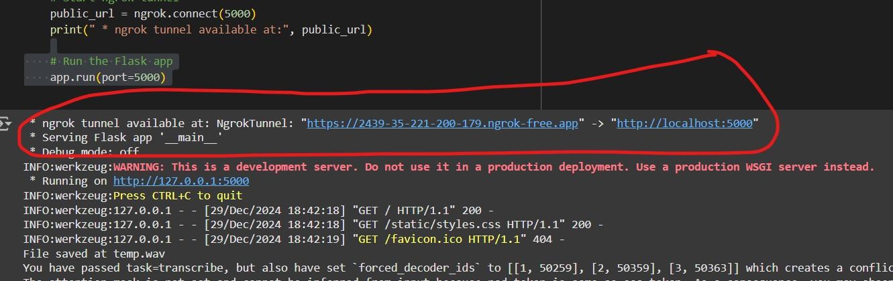
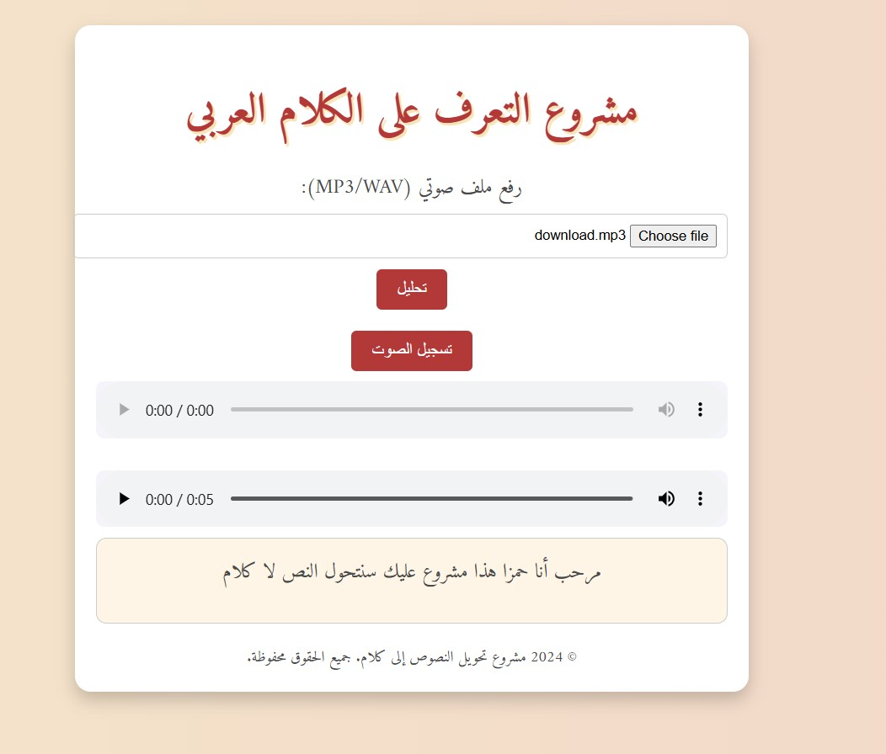

arabic_ai_project/images)

# ASR Using Whisper (Arabic) — Simple Instructions

## 1. Overview
This project demonstrates **Arabic Speech Recognition** using OpenAI’s **Whisper** model. You can **retrain** the model (using Colab and your dataset) or **use** the already-trained model stored in **Google Drive**. The final system is a **Flask**-based website that lets users record or upload audio for transcription in Arabic.

## 2. Running the Project

### A. Retraining or Fine-tuning the Model (Optional)
1. **Mount Google Drive** in your Colab notebook:
   ```python
   from google.colab import drive
   drive.mount('/content/drive')
   ```
2. **Train** or **fine-tune** your Whisper model:
   ```python
   # (example) trainer.train()
   # after training, save the model:
   trainer.save_model(training_args.output_dir)
   processor.save_pretrained(training_args.output_dir)
   ```
3. **Copy** the trained model to Google Drive:
   ```python
   import shutil, os
   drive_output_dir = "/content/drive/MyDrive/whisper-small-hi"

   # Remove old directory if exists
   if os.path.exists(drive_output_dir):
       shutil.rmtree(drive_output_dir)

   shutil.copytree(training_args.output_dir, drive_output_dir)
   print(f"Model saved at {drive_output_dir}")
   ```
> **In most cases**, you won’t need to do this again unless you want to **update** or **retrain** the model.

### B. Using the Already-Trained Model
If you do **not** plan to retrain, you can **use** the model from this link (example):  
**[Google Drive Link](https://drive.google.com/drive/folders/1BGmT2ZsGCWkXhMQYHPUTx7qCcFpq53xs?usp=drive_link)**

1. **Mount Google Drive** in Colab:
   ```python
   from google.colab import drive
   drive.mount('/content/drive')
   ```
2. **Copy** the model from Drive to your local environment (e.g. `./model`):
   ```python
   import shutil, os

   drive_model_dir = "/content/drive/MyDrive/ASR"
   local_model_dir = "./model"
   shutil.copytree(drive_model_dir, local_model_dir)
   print(f"Model copied to {local_model_dir}")
   ```
> Now your model is ready to be loaded by the Flask code.

---

## 3. Running the Flask Website
1. **Install** dependencies (in Colab):
   ```python
   !pip install pydub pyngrok transformers librosa flask
   !mkdir templates static
   ```
2. **Create** your `templates/index.html` and `static/styles.css` (the HTML and CSS are already provided in the code snippet).
3. **Load** the model in your Flask app (example snippet):
   ```python
   from transformers import WhisperProcessor, WhisperForConditionalGeneration
   processor = WhisperProcessor.from_pretrained("model/")
   model = WhisperForConditionalGeneration.from_pretrained("model/")
   ```
4. **Run** the Flask code (the same code you provided in your notebook):
   ```python
   # Start ngrok
   from pyngrok import ngrok
   public_url = ngrok.connect(5000)
   print("Public URL:", public_url)

   # Launch the app
   app.run(port=5000)
   ```
5. **Open** the `public_url` in your browser. You should see the Arabic ASR interface:
   - **Record** your voice or **upload** an audio file.
   - The webpage displays the **transcription** in Arabic after processing.





---

## 4. Additional Notes
- **Recording**: Make sure your browser allows microphone access.  
- **File Upload**: Supports `.mp3` and `.wav`.  
- **Colab GPU** recommended for faster transcriptions.

---

## 5. Related Papers & Inspiration
1. **A Comparative Study of LLM-based ASR and Whisper in Low Resource and Code Switching Scenario**  
   [arxiv.org/html/2412.00721v1#bib.bib19](https://arxiv.org/html/2412.00721v1#bib.bib19)  

2. **A Transfer Learning End-to-End Arabic Text-To-Speech (TTS) Deep Architecture**  
   [ResearchGate Link](https://www.researchgate.net/publication/344018193_A_Transfer_Learning_End-to-End_Arabic_Text-To-Speech_TTS_Deep_Architecture)

*(These guided some architecture choices and gave insight into Arabic speech tasks.)*

---

### That’s it!
This **simple** approach lets anyone **try** your Arabic ASR system:

1. **Mount** Google Drive for the pretrained model.  
2. **Install** the necessary packages.  
3. **Run** the Flask + ngrok code to launch your web interface.  
4. **Open** the public URL to transcribe Arabic speech.  

If you have any **questions** or **suggestions**, feel free to update or improve the code. Good luck!


Here's the updated **README**, including a section explaining how to find and add AWS configuration keys:

---

# **TTS Using Amazon Polly — Simple Instructions**

## 1. Overview
This project demonstrates **Arabic Text-to-Speech** (TTS) using **Amazon Polly**. It provides a **Flask**-based web interface (HTML/JS) for users to **input** Arabic text and **generate** an MP3 file on the fly, served from Google Colab with **ngrok**.

---

## 2. Prerequisites
1. **Google Colab** for easy environment setup.  
2. **AWS Credentials** with access to **Amazon Polly** (so your code can call Polly’s API).  
3. **ngrok** for creating a public URL to your local Flask server.

---

## 3. AWS Configuration Keys: How to Find and Add Them

### Step 1: Sign in to the AWS Console
1. Go to the **AWS Management Console**: [https://aws.amazon.com/console/](https://aws.amazon.com/console/).
2. Navigate to **Identity and Access Management (IAM)** under the "Access Management" section in the sidebar.

### Step 2: Create or Use an IAM User
1. In the IAM dashboard, click **Users** in the left sidebar.
2. Select an existing user with programmatic access or create a new one:
   - Click **Create User**.
   - Assign a username (e.g., "PollyTTSUser").
   - Under **Access Type**, check **Programmatic access** to generate access keys.
   - Add the user to a group or attach a policy with permissions for Polly:
     - Use the **AmazonPollyFullAccess** policy.

### Step 3: Download the Access Keys
1. After creating the user, download the **Access Key ID** and **Secret Access Key** (or note them down).
2. These keys will be required for the `aws configure` step in Google Colab.

---

### Step 4: Add Keys to Google Colab
1. Run the following command in Colab to configure AWS CLI:
   ```bash
   !aws configure
   ```
2. Enter the keys when prompted:
   ```
   AWS Access Key ID [None]: YOUR_ACCESS_KEY
   AWS Secret Access Key [None]: YOUR_SECRET_KEY
   Default region name [None]: us-east-1
   Default output format [None]: json
   ```
3. **Verify configuration**:
   ```bash
   !aws sts get-caller-identity
   ```
   This command should return your user’s ARN, confirming that the credentials are correctly configured.

---

## 4. Setup & Steps for TTS

### A. AWS CLI & Polly Test
Once AWS is configured, you can test Polly directly in Colab:
```bash
!aws polly list-voices --region us-east-1
```
This will display a list of available Polly voices.

### B. Generate TTS in Python (Without Website)
To generate an MP3 using Polly:
```python
import boto3, os

def generate_arabic_tts(text, output_file="arabic_output.mp3", voice_id="Zeina"):
    polly = boto3.client("polly", region_name=os.getenv("AWS_DEFAULT_REGION", "us-east-1"))
    response = polly.synthesize_speech(
        Text=text,
        OutputFormat="mp3",
        VoiceId=voice_id,
        LanguageCode="ar-SA"
    )
    
    if "AudioStream" in response:
        with open(output_file, "wb") as file:
            file.write(response["AudioStream"].read())
        print(f"TTS generated -> {output_file}")
    else:
        raise Exception("Polly did not return an audio stream.")
```
Test it with:
```python
generate_arabic_tts("مرحباً بالعالم!", "arabic_output.mp3")
```

Play the MP3:
```python
from IPython.display import Audio
Audio("arabic_output.mp3")
```

---

## 5. Running the Flask Website with Polly

1. Install dependencies:
   ```bash
   !pip install pyngrok flask boto3
   ```
2. Prepare the Flask app (refer to your HTML and Python code snippet).
3. Start ngrok and Flask:
   ```python
   from pyngrok import ngrok
   public_url = ngrok.connect(5000)
   print(" * ngrok tunnel available at:", public_url)
   app.run(port=5000)
   ```
4. Access the public URL, enter Arabic text, and generate MP3 audio.
   
images/image3.jpg
---

## 6. Saving MP3 to Google Drive (Optional)
To save the generated MP3 file for later:
```python
from google.colab import drive
drive.mount('/content/drive')

!cp arabic_output.mp3 /content/drive/MyDrive/
print("File copied to Google Drive.")
```

---

## 7. Summary

1. **AWS** config + **boto3**: Generate Arabic MP3 using Polly.
2. **Flask** + **ngrok**: Host a web interface to test the TTS.
3. **Save Files**: Optionally save MP3 files to Google Drive.

You’re now set up to demo and share your TTS project with ease!
